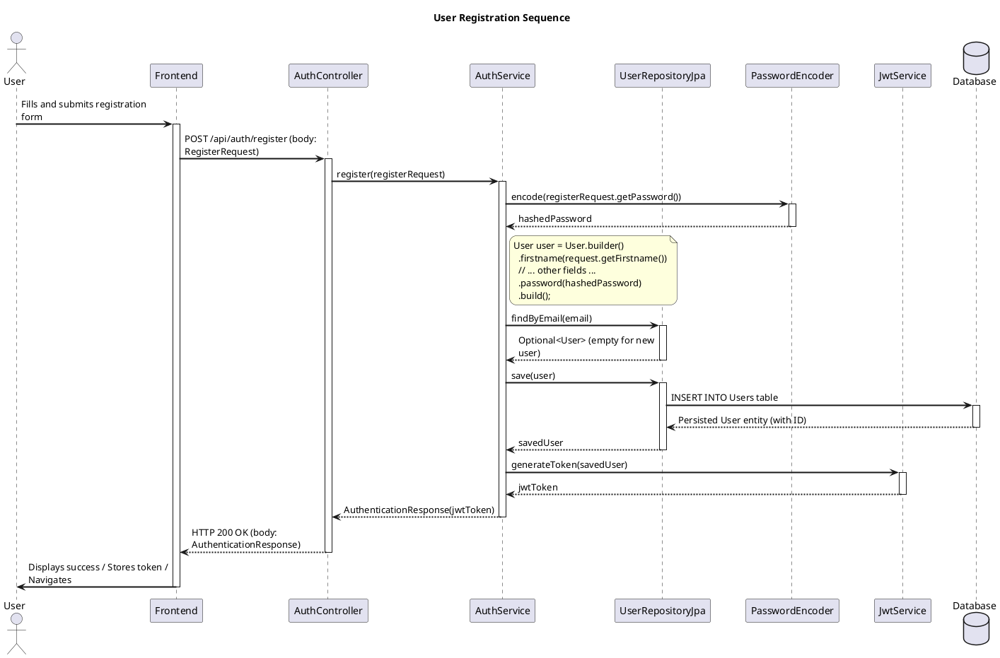
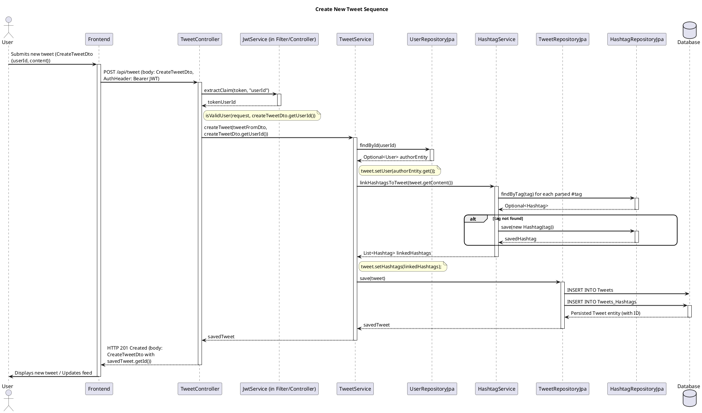
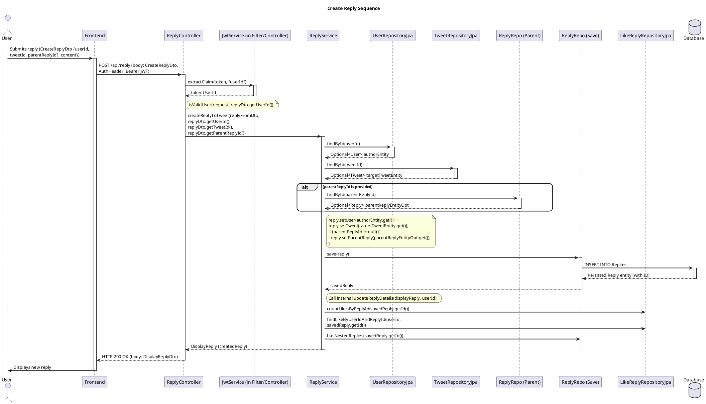
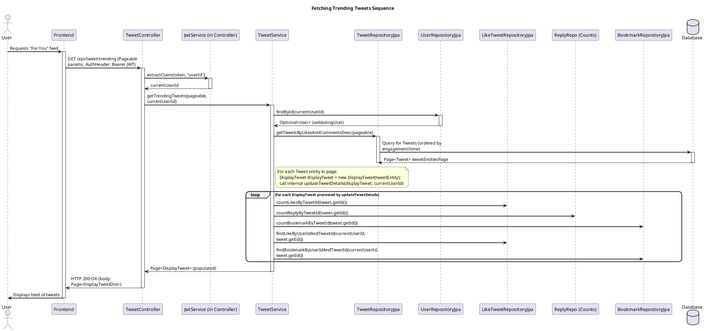
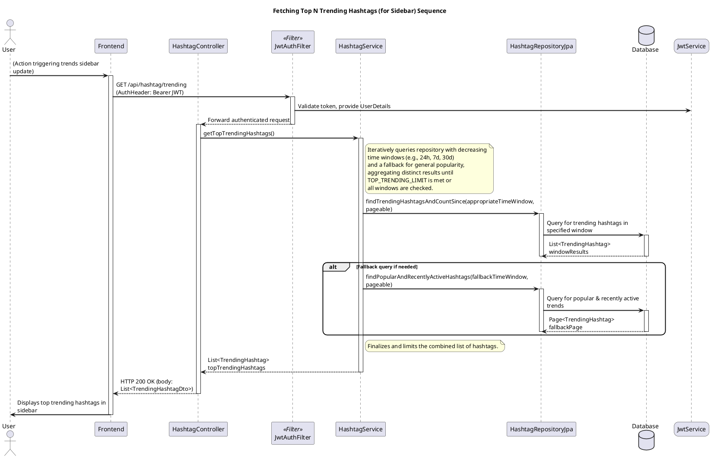
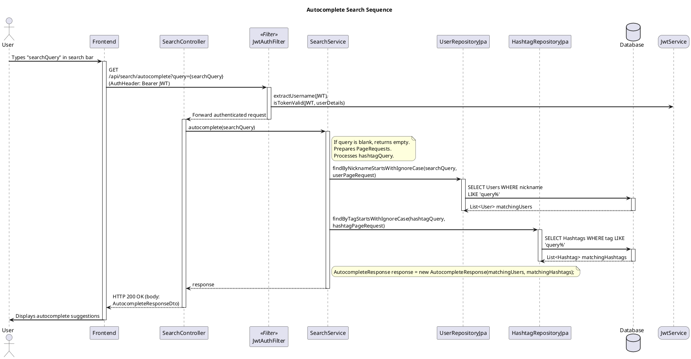

User Registration

```plantuml
@startuml
actor User
participant Frontend
participant AuthController
participant AuthService
participant UserRepositoryJpa
participant PasswordEncoder
participant JwtService
database Database

title User Registration Sequence

skinparam sequenceArrowThickness 2
skinparam roundcorner 20
skinparam maxmessagesize 200
skinparam participantPadding 20
skinparam boxPadding 10

User -> Frontend: Fills and submits registration form
activate Frontend

Frontend -> AuthController: POST /api/auth/register (body: RegisterRequest)
activate AuthController

AuthController -> AuthService: register(registerRequest)
activate AuthService

AuthService -> PasswordEncoder: encode(registerRequest.getPassword())
activate PasswordEncoder
PasswordEncoder --> AuthService: hashedPassword
deactivate PasswordEncoder

note right of AuthService
  User user = User.builder()
    .firstname(request.getFirstname())
    // ... other fields ...
    .password(hashedPassword)
    .build();
end note

AuthService -> UserRepositoryJpa: findByEmail(email)
activate UserRepositoryJpa
UserRepositoryJpa --> AuthService: Optional<User> (empty for new user)
deactivate UserRepositoryJpa

AuthService -> UserRepositoryJpa: save(user)
activate UserRepositoryJpa
UserRepositoryJpa -> Database: INSERT INTO Users table
activate Database
Database --> UserRepositoryJpa: Persisted User entity (with ID)
deactivate Database
UserRepositoryJpa --> AuthService: savedUser
deactivate UserRepositoryJpa

AuthService -> JwtService: generateToken(savedUser)
activate JwtService
JwtService --> AuthService: jwtToken
deactivate JwtService

AuthService --> AuthController: AuthenticationResponse(jwtToken)
deactivate AuthService

AuthController --> Frontend: HTTP 200 OK (body: AuthenticationResponse)
deactivate AuthController

Frontend -> User: Displays success / Stores token / Navigates
deactivate Frontend

@enduml
```

Create New Tweet

```plantuml
@startuml
actor User
participant Frontend
participant TweetController
participant "JwtService (in Filter/Controller)" as JwtServiceCtrl
participant TweetService
participant UserRepositoryJpa
participant HashtagService
participant TweetRepositoryJpa
participant HashtagRepositoryJpa
database Database

title Create New Tweet Sequence

skinparam sequenceArrowThickness 2
skinparam roundcorner 20
skinparam maxmessagesize 250
skinparam participantPadding 20
skinparam boxPadding 10

User -> Frontend: Submits new tweet (CreateTweetDto {userId, content})
activate Frontend

Frontend -> TweetController: POST /api/tweet (body: CreateTweetDto, AuthHeader: Bearer JWT)
activate TweetController

TweetController -> JwtServiceCtrl: extractClaim(token, "userId")
activate JwtServiceCtrl
JwtServiceCtrl --> TweetController: tokenUserId
deactivate JwtServiceCtrl
note right of TweetController: isValidUser(request, createTweetDto.getUserId())

TweetController -> TweetService: createTweet(tweetFromDto, createTweetDto.getUserId())
activate TweetService

TweetService -> UserRepositoryJpa: findById(userId)
activate UserRepositoryJpa
UserRepositoryJpa --> TweetService: Optional<User> authorEntity
deactivate UserRepositoryJpa

note right of TweetService
  tweet.setUser(authorEntity.get());
end note

TweetService -> HashtagService: linkHashtagsToTweet(tweet.getContent())
activate HashtagService
HashtagService -> HashtagRepositoryJpa: findByTag(tag) for each parsed #tag
activate HashtagRepositoryJpa
HashtagRepositoryJpa --> HashtagService: Optional<Hashtag>
deactivate HashtagRepositoryJpa
alt tag not found
    HashtagService -> HashtagRepositoryJpa: save(new Hashtag(tag))
    activate HashtagRepositoryJpa
    HashtagRepositoryJpa --> HashtagService: savedHashtag
    deactivate HashtagRepositoryJpa
end
HashtagService --> TweetService: List<Hashtag> linkedHashtags
deactivate HashtagService

note right of TweetService
  tweet.setHashtags(linkedHashtags);
end note

TweetService -> TweetRepositoryJpa: save(tweet)
activate TweetRepositoryJpa
TweetRepositoryJpa -> Database: INSERT INTO Tweets
TweetRepositoryJpa -> Database: INSERT INTO Tweets_Hashtags
activate Database
Database --> TweetRepositoryJpa: Persisted Tweet entity (with ID)
deactivate Database
TweetRepositoryJpa --> TweetService: savedTweet
deactivate TweetRepositoryJpa

TweetService --> TweetController: savedTweet
deactivate TweetService

TweetController --> Frontend: HTTP 201 Created (body: CreateTweetDto with savedTweet.getId())
deactivate TweetController

Frontend -> User: Displays new tweet / Updates feed
deactivate Frontend

@enduml
```

Create Reply

```plantuml
@startuml
actor User
participant Frontend
participant ReplyController
participant "JwtService (in Filter/Controller)" as JwtServiceCtrl
participant ReplyService
participant UserRepositoryJpa
participant TweetRepositoryJpa
participant "ReplyRepo (Parent)" as ReplyRepositoryParent
participant "ReplyRepo (Save)" as ReplyRepositorySave
participant LikeReplyRepositoryJpa
database Database

title Create Reply Sequence

skinparam sequenceArrowThickness 2
skinparam roundcorner 20
skinparam maxmessagesize 250
skinparam participantPadding 20
skinparam boxPadding 10

User -> Frontend: Submits reply (CreateReplyDto {userId, tweetId, parentReplyId?, content})
activate Frontend

Frontend -> ReplyController: POST /api/reply (body: CreateReplyDto, AuthHeader: Bearer JWT)
activate ReplyController

ReplyController -> JwtServiceCtrl: extractClaim(token, "userId")
activate JwtServiceCtrl
JwtServiceCtrl --> ReplyController: tokenUserId
deactivate JwtServiceCtrl
note right of ReplyController: isValidUser(request, replyDto.getUserId())

ReplyController -> ReplyService: createReplyToTweet(replyFromDto, replyDto.getUserId(), replyDto.getTweetId(), replyDto.getParentReplyId())
activate ReplyService

ReplyService -> UserRepositoryJpa: findById(userId)
activate UserRepositoryJpa
UserRepositoryJpa --> ReplyService: Optional<User> authorEntity
deactivate UserRepositoryJpa

ReplyService -> TweetRepositoryJpa: findById(tweetId)
activate TweetRepositoryJpa
TweetRepositoryJpa --> ReplyService: Optional<Tweet> targetTweetEntity
deactivate TweetRepositoryJpa

alt parentReplyId is provided
    ReplyService -> ReplyRepositoryParent: findById(parentReplyId)
    activate ReplyRepositoryParent
    ReplyRepositoryParent --> ReplyService: Optional<Reply> parentReplyEntityOpt
    deactivate ReplyRepositoryParent
end

note right of ReplyService
  reply.setUser(authorEntity.get());
  reply.setTweet(targetTweetEntity.get());
  if (parentReplyId != null) {
    reply.setParentReply(parentReplyEntityOpt.get());
  }
end note

ReplyService -> ReplyRepositorySave: save(reply)
activate ReplyRepositorySave
ReplyRepositorySave -> Database: INSERT INTO Replies
activate Database
Database --> ReplyRepositorySave: Persisted Reply entity (with ID)
deactivate Database
ReplyRepositorySave --> ReplyService: savedReply
deactivate ReplyRepositorySave

note right of ReplyService: Call internal updateReplyDetails(displayReply, userId)
ReplyService -> LikeReplyRepositoryJpa: countLikesByReplyId(savedReply.getId())
ReplyService -> LikeReplyRepositoryJpa: findLikeByUserIdAndReplyId(userId, savedReply.getId())
ReplyService -> ReplyRepositorySave: hasNestedReplies(savedReply.getId())


ReplyService --> ReplyController: DisplayReply (createdReply)
deactivate ReplyService

ReplyController --> Frontend: HTTP 200 OK (body: DisplayReplyDto)
deactivate ReplyController

Frontend -> User: Displays new reply
deactivate Frontend

@enduml
```

Fetching General Tweets

```plantuml
@startuml
actor User
participant Frontend
participant TweetController
participant "JwtService (in Controller)" as JwtServiceCtrl
participant TweetService
participant TweetRepositoryJpa
participant UserRepositoryJpa
participant LikeTweetRepositoryJpa
participant "ReplyRepo (Counts)" as ReplyRepositoryCounts
participant BookmarkRepositoryJpa
database Database

title Fetching Trending Tweets Sequence

skinparam sequenceArrowThickness 2
skinparam roundcorner 20
skinparam maxmessagesize 220
skinparam participantPadding 20
skinparam boxPadding 10

User -> Frontend: Requests "For You" feed
activate Frontend

Frontend -> TweetController: GET /api/tweet/trending (Pageable params, AuthHeader: Bearer JWT)
activate TweetController

TweetController -> JwtServiceCtrl: extractClaim(token, "userId")
activate JwtServiceCtrl
JwtServiceCtrl --> TweetController: currentUserId
deactivate JwtServiceCtrl

TweetController -> TweetService: getTrendingTweets(pageable, currentUserId)
activate TweetService

TweetService -> UserRepositoryJpa: findById(currentUserId)
activate UserRepositoryJpa
UserRepositoryJpa --> TweetService: Optional<User> (validatingUser)
deactivate UserRepositoryJpa

TweetService -> TweetRepositoryJpa: getTweetsByLikesAndCommentsDesc(pageable)
activate TweetRepositoryJpa
TweetRepositoryJpa -> Database: Query for Tweets (ordered by engagement/time)
activate Database
Database --> TweetRepositoryJpa: Page<Tweet> tweetEntitiesPage
deactivate Database
deactivate TweetRepositoryJpa

note right of TweetService
  For each Tweet entity in page:
    DisplayTweet displayTweet = new DisplayTweet(tweetEntity);
    call internal updateTweetDetails(displayTweet, currentUserId)
end note

loop for each DisplayTweet processed by updateTweetDetails
    TweetService -> LikeTweetRepositoryJpa: countLikesByTweetId(tweet.getId())
    TweetService -> ReplyRepositoryCounts: countReplyByTweetId(tweet.getId())
    TweetService -> BookmarkRepositoryJpa: countBookmarkByTweetId(tweet.getId())
    TweetService -> LikeTweetRepositoryJpa: findLikeByUserIdAndTweetId(currentUserId, tweet.getId())
    TweetService -> BookmarkRepositoryJpa: findBookmarkByUserIdAndTweetId(currentUserId, tweet.getId())
end

TweetService --> TweetController: Page<DisplayTweet> (populated)
deactivate TweetService

TweetController --> Frontend: HTTP 200 OK (body: Page<DisplayTweetDto>)
deactivate TweetController

Frontend -> User: Displays feed of tweets
deactivate Frontend

@enduml
```

Fetching Trending Hashtags

```plantuml
@startuml
actor User
participant Frontend
participant HashtagController
participant "JwtAuthFilter" as Filter <<Filter>>
participant HashtagService
participant HashtagRepositoryJpa
database Database

title Fetching Top N Trending Hashtags (for Sidebar) Sequence

skinparam sequenceArrowThickness 2
skinparam roundcorner 20
skinparam maxmessagesize 220
skinparam participantPadding 20
skinparam boxPadding 10

User -> Frontend: (Action triggering trends sidebar update)
activate Frontend

Frontend -> Filter: GET /api/hashtag/trending (AuthHeader: Bearer JWT)
activate Filter
Filter -> JwtService: Validate token, provide UserDetails
Filter --> HashtagController: Forward authenticated request
deactivate Filter
activate HashtagController

HashtagController -> HashtagService: getTopTrendingHashtags()
activate HashtagService

note right of HashtagService
  Iteratively queries repository with decreasing
  time windows (e.g., 24h, 7d, 30d)
  and a fallback for general popularity,
  aggregating distinct results until
  TOP_TRENDING_LIMIT is met or
  all windows are checked.
end note

HashtagService -> HashtagRepositoryJpa: findTrendingHashtagsAndCountSince(appropriateTimeWindow, pageable)
activate HashtagRepositoryJpa
HashtagRepositoryJpa -> Database: Query for trending hashtags in specified window
activate Database
Database --> HashtagRepositoryJpa: List<TrendingHashtag> windowResults
deactivate Database
deactivate HashtagRepositoryJpa
' This interaction (Service -> Repo -> DB -> Repo -> Service) may repeat

alt Fallback query if needed
    HashtagService -> HashtagRepositoryJpa: findPopularAndRecentlyActiveHashtags(fallbackTimeWindow, pageable)
    activate HashtagRepositoryJpa
    HashtagRepositoryJpa -> Database: Query for popular & recently active trends
    activate Database
    Database --> HashtagRepositoryJpa: Page<TrendingHashtag> fallbackPage
    deactivate Database
    deactivate HashtagRepositoryJpa
end

note right of HashtagService: Finalizes and limits the combined list of hashtags.
HashtagService --> HashtagController: List<TrendingHashtag> topTrendingHashtags
deactivate HashtagService

HashtagController --> Frontend: HTTP 200 OK (body: List<TrendingHashtagDto>)
deactivate HashtagController

Frontend -> User: Displays top trending hashtags in sidebar
deactivate Frontend

@enduml
```

Autocomplete Search

```plantuml
@startuml
actor User
participant Frontend
participant SearchController
participant "JwtAuthFilter" as Filter <<Filter>>
participant SearchService
participant UserRepositoryJpa
participant HashtagRepositoryJpa
database Database

title Autocomplete Search Sequence

skinparam sequenceArrowThickness 2
skinparam roundcorner 20
skinparam maxmessagesize 220
skinparam participantPadding 20
skinparam boxPadding 10

User -> Frontend: Types "searchQuery" in search bar
activate Frontend

Frontend -> Filter: GET /api/search/autocomplete?query={searchQuery} (AuthHeader: Bearer JWT)
activate Filter
Filter -> JwtService: extractUsername(JWT), isTokenValid(JWT, userDetails)
Filter --> SearchController: Forward authenticated request
deactivate Filter
activate SearchController

SearchController -> SearchService: autocomplete(searchQuery)
activate SearchService

note right of SearchService
  If query is blank, returns empty.
  Prepares PageRequests.
  Processes hashtagQuery.
end note

SearchService -> UserRepositoryJpa: findByNicknameStartsWithIgnoreCase(searchQuery, userPageRequest)
activate UserRepositoryJpa
UserRepositoryJpa -> Database: SELECT Users WHERE nickname LIKE 'query%'
activate Database
Database --> UserRepositoryJpa: List<User> matchingUsers
deactivate Database
deactivate UserRepositoryJpa

SearchService -> HashtagRepositoryJpa: findByTagStartsWithIgnoreCase(hashtagQuery, hashtagPageRequest)
activate HashtagRepositoryJpa
HashtagRepositoryJpa -> Database: SELECT Hashtags WHERE tag LIKE 'query%'
activate Database
Database --> HashtagRepositoryJpa: List<Hashtag> matchingHashtags
deactivate Database
deactivate HashtagRepositoryJpa

note right of SearchService
  AutocompleteResponse response = new AutocompleteResponse(matchingUsers, matchingHashtags);
end note
SearchService --> SearchController: response
deactivate SearchService

SearchController --> Frontend: HTTP 200 OK (body: AutocompleteResponseDto)
deactivate SearchController

Frontend -> User: Displays autocomplete suggestions
deactivate Frontend

@enduml
```

